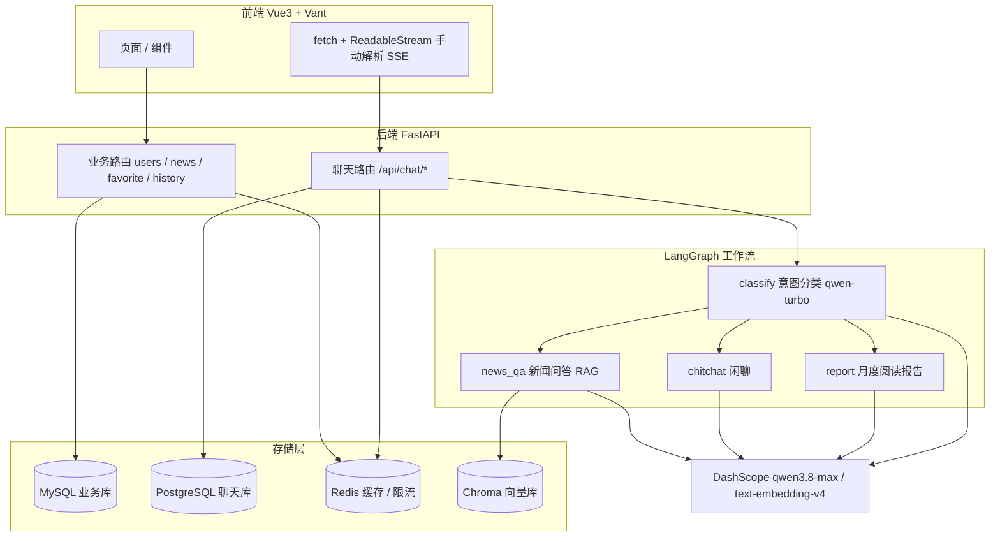
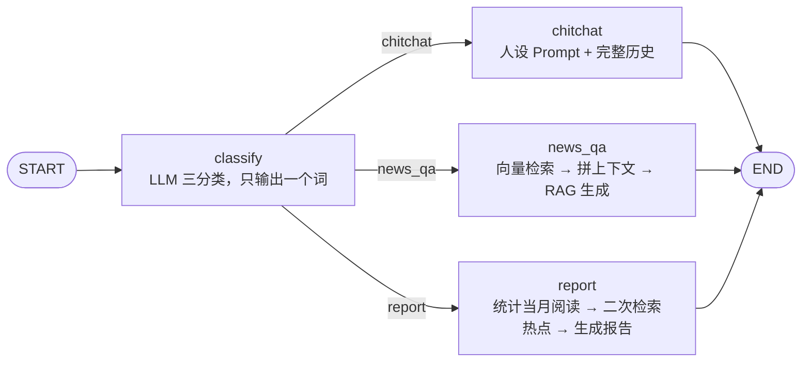

# 今日新闻 App · Toutiao News

一个仿今日头条的新闻资讯应用：**FastAPI 异步后端 + Vue3 移动端 + LangGraph 驱动的站内新闻 RAG 智能问答**。

用户注册登录后可以浏览/收藏/记录新闻，并向 AI 助手提问站内新闻；AI 依据会话历史自动在「闲聊 / 新闻问答 / 月度阅读报告」三条链路间路由，回答以 SSE 逐字流式返回。

---

## 目录导览

| 目录 | 内容 |
| --- | --- |
| [`backend/`](backend/) | FastAPI 后端 + AI Agent 核心 |
| [`frontend/web/`](frontend/web/) | Vue3 + Vite 移动端 |
| [`docs/`](docs/) | 接口规范、数据库 SQL、后端设计说明 |
| [`backend/text/`](backend/text/) | 压测 / 评测集 / 延迟诊断 / pytest 冒烟测试 |
| [`backend/项目改进与测试报告.md`](backend/项目改进与测试报告.md) | 一次完整的缺陷定位与性能优化记录（含实测数字与排查过程） |

---

## 功能特性

**业务侧**

- 用户：注册、登录、令牌鉴权、资料修改、密码修改（bcrypt 加密存储）
- 新闻：分类导航、分页列表、详情、浏览量统计、相关新闻推荐
- 收藏：添加 / 取消 / 列表 / 清空 / 状态检查
- 历史：浏览记录写入（同一新闻重复浏览只更新时间）、列表、删除、清空

**AI 侧**

- **意图路由**：LangGraph 状态图把每条消息分到三条链路，意图分类用轻量模型（`qwen-turbo`），生成用高质量模型（`qwen3.8-max`）
- **站内新闻 RAG**：回答严格基于向量检索到的新闻片段，Prompt 内置 8 条防编造约束；检索结果带发布时间，可识别「当天是否有新新闻」
- **月度阅读报告**：聚合当月阅读量 / 活跃天数 / 分类 Top3 / 近一周话题，再检索相关热点作为拓展推荐
- **SSE 流式输出**：`graph.astream(stream_mode="messages")` 逐 token 推送，并过滤掉意图分类过程产生的 token
- **多轮记忆**：会话历史持久化在 PostgreSQL，Redis 做二级缓存（TTL 2h）
- **增量向量索引**：按内容 MD5 判断新闻是否变化，只重建变更过的文档
- **embedding 缓存**：相同文本的向量结果缓存 7 天，省调用与费用
- **限流防刷**：Redis `INCR` 固定窗口，每用户 20 次/分钟

---

## 技术栈

| 层 | 选型 |
| --- | --- |
| Web 框架 | FastAPI 0.141 · Starlette · Uvicorn |
| ORM / 驱动 | SQLAlchemy 2.0（全异步）· aiomysql · asyncpg |
| 数据库 | MySQL（业务库 `news_app`）· PostgreSQL（聊天库 `chat_db`，**故意分库**） |
| 缓存 | Redis（新闻缓存 / 会话缓存 / 限流 / embedding 缓存） |
| AI 编排 | LangGraph 1.2（StateGraph + 条件边）· LangChain 1.5 |
| 向量库 | Chroma（本地持久化） |
| 模型 | DashScope OpenAI 兼容端点：`qwen3.8-max`（生成）· `qwen-turbo`（分类）· `text-embedding-v4`（嵌入） |
| 鉴权 | 自建令牌表 + `Authorization: Bearer`（有效期 7 天） |
| 前端 | Vue 3 · Vite 7 · Pinia · Vue Router · Vant 4 · vue-i18n · marked + DOMPurify |
| 测试 | pytest（20 条冒烟用例，离线可跑，LLM 用例由环境变量开关） |

---

## 系统架构



### AI 问答链路



设计要点：

1. **分类与生成用不同档位的模型**。分类只需要输出 `chitchat` / `news_qa` / `report` 中的一个词，用最高档模型是浪费——实测它要「思考」3~5 秒。
2. **关闭思考模式**（`extra_body={"enable_thinking": False}`）。qwen3 系列默认在回答前先推理，思考过程会流式吐出但 `content` 为空，用户感知到的首字延迟几乎全部来自这段思考时间。这一项把首字延迟从 **32.9 秒降到 1.3 秒**（详见[改进报告](backend/项目改进与测试报告.md)）。
3. **检索做两段式**：先按语义召回 `k*3` 条，再按发布时间倒序取前 `k` 条，兼顾相关性与时效性。
4. **上下文注入当天日期**，让模型能对比新闻发布时间判断「今天有没有新新闻」，并在资料不足时明确拒答而不是编造。

---

## 快速开始

### 前置：三个服务

| 服务 | 端口 | 用途 |
| --- | --- | --- |
| MySQL | 3306 | 业务库 `news_app` |
| PostgreSQL | **5433** | 聊天库 `chat_db` |
| Redis | 6379 | 缓存与限流 |

### 1. 建库建表

```bash
# MySQL 业务库（含分类、新闻种子数据）
mysql -u root -p < docs/02-数据库sql文件/database.sql

# PostgreSQL 聊天库
psql -U postgres -c "CREATE DATABASE chat_db;"
psql -U postgres -c "CREATE USER chatuser WITH PASSWORD '你的密码';"
psql -U postgres -c "GRANT ALL PRIVILEGES ON DATABASE chat_db TO chatuser;"
psql -U chatuser -d chat_db -f docs/02-数据库sql文件/chat_db.sql
```

### 2. 后端

```bash
cd backend

# 依赖
python -m pip install -r requirements.txt

# 配置环境变量（.env 不会被提交，请从模板复制后填自己的值）
cp .env.example .env        # Windows: Copy-Item .env.example .env
# 至少填好 DASHSCOPE_API_KEY 与 MYSQL_PASSWORD / PG_PASSWORD / REDIS_PASSWORD

# 启动
python -m uvicorn main:app --reload --host 127.0.0.1 --port 8000
```

接口文档：<http://127.0.0.1:8000/docs>

### 3. 构建向量库（AI 问答必需）

向量库与它的增量索引指纹都**不入版本库**（属可再生的派生数据），首次使用需要自己构建：

```bash
cd backend
python -c "from rag.vector import VectorService; VectorService().load_document_sync()"
```

它会分页读取 `news` 表全部新闻，切分后写入 `chroma_db/`，并把每篇的 MD5 记到 `md5.text`。**再次执行时只处理内容有变化的新闻**，所以可以反复运行。

> 未经此步骤，`news_qa` 链路检索不到任何资料，AI 会如实回答"资料中未覆盖"。

### 4. 前端

```bash
cd frontend/web
npm install
npm run dev          # 默认 http://localhost:5173
```

后端地址写在 [`frontend/web/src/config/api.js`](frontend/web/src/config/api.js)，默认 `http://127.0.0.1:8000`。

---

## 环境变量

全部配置项见 [`backend/.env.example`](backend/.env.example)。要点：

- **`DASHSCOPE_API_KEY` 必填**。项目走的是 DashScope 的 **OpenAI 兼容端点**，并未引入 dashscope 原生 SDK。
- 数据库与 Redis 凭据已全部改为从环境变量读取（`backend/config/env.py` 统一加载），源码中不存在任何明文密码；未配置时会回退到本机默认端口与库名。
- `LANGSMITH_TRACING` 默认 `false`。改成 `true` 后你的对话内容与检索结果会上传到 LangSmith。

---

## API 一览

统一响应格式 `{ code, message, data }`；需鉴权的接口带 `Authorization: Bearer <token>`。

| 模块 | 方法与路径 | 说明 |
| --- | --- | --- |
| 用户 | `POST /api/user/register` | 注册（返回 token） |
| | `POST /api/user/login` | 登录（返回 token） |
| | `GET /api/user/info` | 获取当前用户信息 |
| | `PUT /api/user/update` | 更新资料 |
| | `PUT /api/user/password` | 修改密码 |
| 新闻 | `GET /api/news/categories` | 分类列表 |
| | `GET /api/news/list` | 新闻列表（分页 + 分类筛选） |
| | `GET /api/news/detail` | 详情（同时累加浏览量、返回相关新闻） |
| 收藏 | `GET /api/favorite/check` | 是否已收藏 |
| | `POST /api/favorite/add` | 添加收藏 |
| | `DELETE /api/favorite/remove` | 取消收藏 |
| | `GET /api/favorite/list` | 收藏列表 |
| | `DELETE /api/favorite/clear` | 清空收藏 |
| 历史 | `POST /api/history/add` | 写入浏览记录 |
| | `GET /api/history/list` | 浏览历史列表 |
| | `DELETE /api/history/delete/{id}` | 删除单条 |
| | `DELETE /api/history/clear` | 清空历史 |
| 对话 | `POST /api/chat/session` | 新建会话 |
| | `GET /api/chat/sessions` | 会话列表 |
| | `DELETE /api/chat/session/{id}` | 删除会话（同时清理消息与缓存） |
| | `GET /api/chat/session/{id}/messages` | 某会话的历史消息 |
| | `POST /api/chat/stream` | **发消息，SSE 流式返回** |

详见 [`docs/01-接口规范文档/API接口规范文档.md`](docs/01-接口规范文档/API接口规范文档.md)。

---

## 测试与评测

`backend/text/` 下是一整套"让效果可量化"的工具：

```bash
cd backend

# 冒烟测试：20 条用例，不调大模型（需先启动服务）
python -m pytest text/test_smoke.py -q
# 预期：16 passed, 4 skipped

# 连大模型用例一起跑（会消耗 API 配额）
#   Windows PowerShell:
$env:RUN_LLM_TESTS=1; python -m pytest text/test_smoke.py -q

# 接口压测（4 种场景：news / chat / login / mixed）
python text/load_test.py --scenario news --users 30 --duration 20

# 从真实新闻半自动生成评测集草稿 → 人工核对 → 跑评测
python text/build_eval_set.py --limit 15 --use-llm
python text/run_eval.py --accounts 3

# 延迟诊断：四段计时，定位慢在哪一层
python text/probe_latency.py --quick
```

评测集分 5 类（单话题 / 时间限定 / 追问 / 库外问题 / 闲聊），打分看三个判据：**要点命中率、禁词违规、拒答正确性**。用法与结果解读见 [`backend/text/README.md`](backend/text/README.md)。

---

## 实测性能（单机，2026-09）

| 指标 | 优化前 | 优化后 |
| --- | --- | --- |
| 首字延迟 P50 | 32.9 s | **1.3 s** |
| 首字延迟 P95 | 45.5 s | **2.5 s** |
| 单次回答平均耗时 | 32.4 s | **4.6 s** |
| 自动化测试 | 0 条 | **20 条全绿** |

优化的根因定位过程（如何用「统计流式响应中内容为空的数据块数量」证明是模型思考模式而非网络问题）记录在[改进报告](backend/项目改进与测试报告.md)中。同一份报告还包含三个真实缺陷的定位与修复：

1. 异常类导入错误 → 本应 404 的「新闻不存在」全部变成 500
2. `create_token` 的提交漏写在 `else` 分支 → 重新登录拿到的令牌在数据库里查不到，且续期永不生效
3. 删除会话时先按 `session_id` 删消息、**未校验归属** → 可越权清空他人聊天记录

---

## 已知限制

坦诚列出，避免误用：

- **它不是真正的 tool-calling Agent**。全项目没有 `bind_tools` / `ToolNode`，`@tool` 装饰的函数由节点直接调用，本质是「意图分类 + 路由 + RAG」。真要接 Function Calling 的话，替换点是 `backend/ai_agent/graph.py`。
- **多轮记忆是全量历史直接进上下文**，没有摘要或滑窗裁剪，长会话会顶到模型上下文上限。
- **异步链路里混有同步阻塞调用**：`news_qa_node` 内的 `RetrieverService.search()` 是同步方法（内部要请求 embedding API 并查 Chroma），`cache/embedding_cache.py` 用的也是同步 Redis 客户端。高并发下会阻塞事件循环，修法是包一层 `asyncio.to_thread`。
- **`AgentState.messages` 是裸 `list`**（未用 `Annotated[list, add_messages]`），当前靠"每次请求重新传入完整历史、图只跑一次"侥幸不出问题；一旦挂 checkpointer 会被覆盖掉上一轮。
- **令牌 7 天硬过期且无续期机制**，活跃用户第 8 天仍需重新登录。
- **CORS 为 `allow_origins=["*"]` 且允许携带凭据**，生产环境必须收紧。
- 约 27% 的分类只有 2023 年数据，「今天有什么 XX 新闻」这类问题在部分分类下只会返回旧闻——这是**测试数据分布**决定的，不是检索缺陷。

---

## 相关文档

- [接口规范](docs/01-接口规范文档/API接口规范文档.md)
- [后端设计说明](docs/项目后端设计说明文档.md)
- [数据库建表脚本](docs/02-数据库sql文件/database.sql)
- [工程改进与测试报告](backend/项目改进与测试报告.md)
- [压测与评测工具说明](backend/text/README.md)

---

## License

[MIT](LICENSE)
